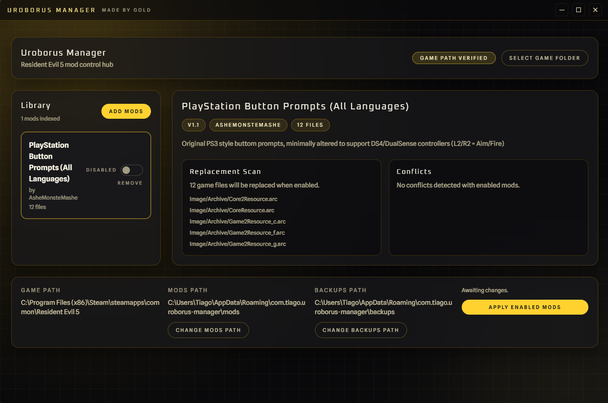

# Uroborus manager



## Description

A mod manager for Resident Evil 5 (2009)

## Getting started

### Prerequisites

- [Node.js](https://nodejs.org/en)
- [Rust](https://www.rust-lang.org/tools/install)

### Installation

1. Clone the repository:

    ```bash
     git clone https://github.com/TiagoRibeiro25/Uroborus-Manager.git
     cd Uroborus-Manager
    ```

2. Install dependencies:

    ```bash
    npm install
    ```

3. Run the app in development mode (export export WEBKIT_DISABLE_DMABUF_RENDERER=1 on linux with wayland):

    ```bash
    npm run tauri dev
    ```

4. Build the app for production:

    ```bash
    npm run tauri build
    ```

### 7-Zip (Windows builds)

Place the standalone `7z.exe` from [7-Zip Extra](https://www.7-zip.org/download.html) at `src-tauri/bin/7z.exe` before building for Windows. It is embedded into the executable at compile time, so portable copies do not need a separate `bin` folder next to the app.

## License

This project is licensed under the MIT License - see the [LICENSE](LICENSE) file for details.

Windows builds embed `7z.exe` from 7-Zip Extra at compile time.
7-Zip is licensed separately under the GNU LGPL and other licenses.
